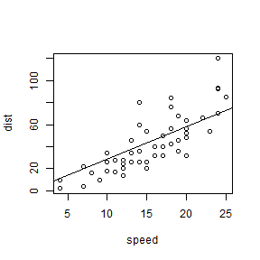

## Introduction

The app uses 'cars' dataset in R. It fits Linear Regression model to the data, treating distance as response and speed as regressor.


```r
head(cars)
```

```
##   speed dist
## 1     4    2
## 2     4   10
## 3     7    4
## 4     7   22
## 5     8   16
## 6     9   10
```

---

## Plotting speed and dist


```r
plot(cars)
```

 

---

## Linear Regression 

As speed and distance have a positive correlation, a linear regression will be a good fit for the data. When speed = 0 mph, dist = 0. Hence we do not calculate the intercept in the model. 

```r
model <- lm(dist~speed -1, data = cars)
plot(cars)
abline(model)
```

 

---
## Summary of the fitted model


```
## 
## Call:
## lm(formula = dist ~ speed - 1, data = cars)
## 
## Residuals:
##     Min      1Q  Median      3Q     Max 
## -26.183 -12.637  -5.455   4.590  50.181 
## 
## Coefficients:
##       Estimate Std. Error t value Pr(>|t|)    
## speed   2.9091     0.1414   20.58   <2e-16 ***
## ---
## Signif. codes:  0 '***' 0.001 '**' 0.01 '*' 0.05 '.' 0.1 ' ' 1
## 
## Residual standard error: 16.26 on 49 degrees of freedom
## Multiple R-squared:  0.8963,	Adjusted R-squared:  0.8942 
## F-statistic: 423.5 on 1 and 49 DF,  p-value: < 2.2e-16
```

